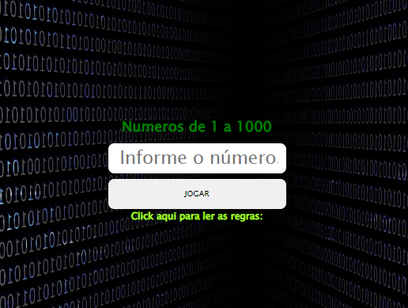
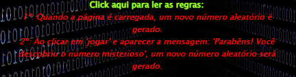

# Oracle+Alura

## Primeiro projeto do curso realizado pela Oracle em parceira com Alura:

Descobrir o número aleatório gerado pelo _Math.random_ e ir realizando chutes até acertar. 

Link: <a href="https://anasouza.top/src/src/index.html" target="_blank">Descobrir número</a>

### leia as regras e divirta-se:

